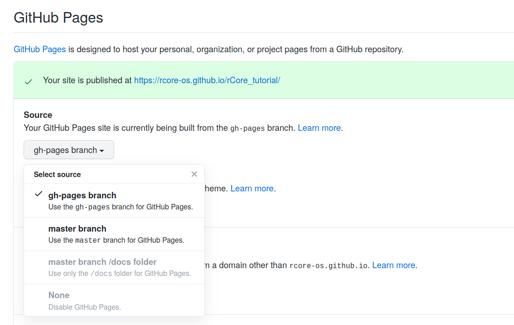

这里简单记录一下基于 hexo/gh-pages 搭建 Github 项目博客的一个过程，希望大家能基于这个平台进行更方便的交流，并为后来者留下更多的启示。
<!-- more -->

## 初始化

1. 安装 hexo: `npm install hexo-cli -g`

2. 为你的项目新建 `blog-host` 分支用来维护博客主体，在该分支下 `hexo init blog`

3. 安装 hexo 部署插件： `npm install hexo-deployer-git --save`

4. 修改 `blog` 目录下的 `_config.yml` 文件，假设当前的项目地址为 `https://github.com/<username>/<repo>`，例如 rCore tutorial 第二版的地址为 `https://github.com/rcore-os/rCore_tutorial`，则 `<username>` 为 rcore-os，`<repo>` 为 rCore_tutorial。
  首先，修改 `url` 和 `root` 项如下：

  ```yml
  url: http://rcore-os.github.io/rCore_tutorial
  root: /rCore_tutorial/
  ```

  注意，格式要严格与上面一致。

  其次，修改部署方式：

  ```yml
  deploy:
    type: git
    repo: https://github.com/rcore-os/rCore_tutorial
    branch: gh-pages
  ```

  这里方便起见，我们直接部署到 repo 的 `gh-pages` 分支上。

5. 为你的项目新建 `gh-pages` 分支用于发布生成的博客页面，再在项目的设置中将 Pages 来源改为 `gh-pages` 分支，如下图所示：

   

6. 回到我们本地的 `blog-host` 分支，直接 `hexo clean && hexo deploy` 部署即可

7. 访问 `https://rcore-os.github.io/rCore_tutorial/`，发现我们的博客已经搭起来了！

   之后还可以进行很多界面美化和功能拓展，就请大家自己深入探索了。

## 博客维护

只要切换到 `blog-host` 分支，通过 `hexo new post` 发布新博客，随后 hexo 会为你自动创建一个同名的 Markdown，编辑之后重新 `hexo clean && hexo deploy` 部署即可。在这之后也别忘了将 `blog-host` 分支同样 push 上去。

